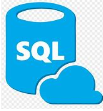

# MSSQL Database MCP Server (Enhanced Version)

<p align="center">
  
</p>

<p align="center">

  <a href="https://github.com/sathwik-3721/Microsoft-MSSQL-MCP/stargazers">
    
  </a>

  <a href="https://github.com/sathwik-3721/Microsoft-MSSQL-MCP/network/members">
    
  </a>

  <a href="https://github.com/sathwik-3721/Microsoft-MSSQL-MCP/issues">
    
  </a>

  <a href="https://github.com/sathwik-3721/Microsoft-MSSQL-MCP/blob/main/LICENSE">
    
  </a>

</p>

<p align="center">
  <strong>Enterprise-ready enhanced Microsoft SQL Server MCP server implementation featuring HTTP/SSE transports, advanced schema discovery, cloud deployment readiness, and compatibility with leading AI agent frameworks.</strong>
</p>

> [!NOTE]
> This repository is a heavily enhanced version of the original [Azure-Samples/SQL-AI-samples (MssqlMcp/Node)](https://github.com/Azure-Samples/SQL-AI-samples/tree/main/MssqlMcp/Node) repository. It contains substantial enhancements to support web-based agent frameworks, cloud deployments, and advanced schema discovery.

---

## 🚀 Key Improvements in this Version

Compared to the upstream Azure-Samples template, which was restricted to running locally via standard input/output (`stdio`), this enhanced version has been redesigned for enterprise AI agent systems:

### 1. HTTP and SSE Transport Modes (Agent Ready)

* **Upstream**: Only supported `stdio` transport, limiting use to local clients like Claude Desktop or local VS Code extensions.
* **This Version**: Includes full support for **Streamable HTTP** (MCP spec 2025-03-26) and **legacy Server-Sent Events (SSE)**. You can run the server as a standalone daemon (e.g. on port `8080`) by executing:

  ```bash
  node dist/index.js --http
  ```

* **Why it matters**: This makes the server fully deployable to cloud environments like **Azure Container Apps (ACA)** or **AWS Fargate**, where remote web-based Agent Frameworks (e.g., Microsoft Agent Framework, AutoGen, Semantic Kernel) can connect to it over standard HTTP/HTTPS.

### 2. Enhanced `schema_discovery` Tool

* **Upstream**: Required the agent to call `list_tables` followed by `describe_table` individually for every single table. This resulted in an $N+1$ network call overhead, causing high latency and token consumption.
* **This Version**: Adds the `schema_discovery` tool, which fetches the metadata blueprint of the entire database in a single query:
  * Table & View Names with Type Classification (`object_type`: `'TABLE'` or `'VIEW'`)
  * Columns and Data Types (`column_name`, `column_type`)
  * Data constraints (`max_length`, `precision`, `scale`, `is_nullable`, `has_default`)
  * Table-level and Column-level descriptions (`table_description`, `column_description`) resolved via SQL Server **Extended Properties** (`MS_Description`).
  * Database Relationships (`relationships`): Physical Foreign Keys and `SemanticJoinTarget` extended properties.
* **Why it matters**: The LLM can bootstrap its context in a single call, understand the database layout, inspect table relationships, and use table descriptions to semantically map user requests (like "customer history") to the exact matching database tables.

### 3. New `list_view` Tool

* **Upstream**: Only supported listing user tables (`BASE TABLE`s). It was impossible for the LLM to know if views or materialized views existed.
* **This Version**: Adds the `list_view` tool, which queries `INFORMATION_SCHEMA.VIEWS` to retrieve all views and their SQL definitions (`VIEW_DEFINITION`).
* **Why it matters**: Allows the LLM to inspect view logic and query views directly using `read_data` or describe them using `describe_table` to get their schemas.

### 4. Broadened Authentication Options

* **Upstream**: Designed primarily for local token authentication.
* **This Version**: Automatically detects the environment and switches between:
  * **SQL Auth**: Plain SQL Server login credentials (`SQL_USER` + `SQL_PASSWORD`). Best for local development or traditional servers.
  * **Azure AD Managed Identity**: Using `DefaultAzureCredential`. Ideal for zero-credential secure connections inside Azure Container Apps.
  * **Azure AD Interactive Login**: Using `InteractiveBrowserCredential` as a fallback.

### 5. Executed Query Visibility in Responses

* **This Version**: Every tool response now includes the exact SQL query executed by the tool under a `query` field in the JSON payload.
* **Why it matters**: Allows developers and upstream agent frameworks to debug, audit, and log the exact queries generated by the agent.

### 6. Actionable Diagnostics and Self-Correction

* **This Version**: The `read_data` tool returns the actual database engine error details on failure rather than masking them behind a generic security message.
* **Why it matters**: Exposing database-level errors (like invalid column or table names) allows AI agents to inspect the error message and successfully self-correct their query.

---

## What Can It Do? 📊

* **Schema Discovery**: Learn the structure of tables, views, columns, and descriptions.
* **Read-Only / Read-Write operations**: Run standard `SELECT` queries with safety protections.
* **Write Operations (if enabled)**: Run `INSERT`, `UPDATE`, `DELETE`, and schema modification (`CREATE TABLE`, `CREATE INDEX`, `DROP TABLE`).
* **Connection Health Monitoring**: Diagnostic `/health`, `/ready`, and `/metrics` REST endpoints when running in HTTP mode.

---

## Quick Start 🚀

### Prerequisites

* Node.js 16 or higher
* Microsoft SQL Server or Azure SQL Database

### Set up project

1. **Install Dependencies**  

   ```bash
   npm install
   ```

2. **Build the Project**  
   Compile the TypeScript code:  

   ```bash
   npm run build
   ```

---

## Running the Server

### Option A: Standalone HTTP/SSE Mode (Recommended for Cloud & Web Agents)

Start the server in HTTP mode to listen on a port (defaults to `8080` or the `PORT` env variable):

```bash
node dist/index.js --http
```

**Exposed Endpoints:**

* `POST /mcp` - Streamable HTTP protocol endpoint.
* `GET /sse` - Legacy SSE initialization stream.
* `GET /tools` - REST list of all exposed MCP tools.
* `GET /health` - Liveness & Database connection readiness check.

### Option B: Local stdio Mode (Default - for local IDEs & Claude Desktop)

Start the server using standard input/output (`stdio`). This is the default mode used by local MCP clients like Claude Desktop, Cursor, or VS Code extensions:

```bash
node dist/index.js
```

**Claude Desktop Configuration Example (`claude_desktop_config.json`):**

To configure Claude Desktop to use this server, add the following to your configuration file (typically located at `%APPDATA%\Claude\claude_desktop_config.json` on Windows):

```json
{
  "mcpServers": {
    "mssql-mcp-server": {
      "command": "node",
      "args": ["/path/to/your/project/dist/index.js"],
      "env": {
        "SERVER_NAME": "your-server-name.database.windows.net",
        "DATABASE_NAME": "your-database-name",
        "SQL_USER": "developer",
        "SQL_PASSWORD": "your-secure-password",
        "READONLY": "true"
      }
    }
  }
}
```

### Option C: Interactive Testing with MCP Inspector (`@modelcontextprotocol/inspector`)

You can test tool definitions, schema discovery, and query execution interactively in your browser using the official MCP Inspector.

#### 1. Stdio Mode (Default)
```bash
npx @modelcontextprotocol/inspector node dist/index.js
```

To test read-only mode (`READONLY=true`):
* **PowerShell**: `$env:READONLY="true"; npx @modelcontextprotocol/inspector node dist/index.js`
* **CMD**: `set READONLY=true && npx @modelcontextprotocol/inspector node dist/index.js`
* **Bash**: `READONLY=true npx @modelcontextprotocol/inspector node dist/index.js`

#### 2. HTTP / Streamable HTTP Mode
First start the server in HTTP mode:
```bash
node dist/index.js --http
```

Then launch the Inspector targeting the HTTP endpoint in a separate terminal:
```bash
npx @modelcontextprotocol/inspector http://localhost:8080/mcp
```

---

## Environment Variables Configuration (`.env`)

Configure the following variables in a `.env` file at the root of the project:

```ini
# Database Connection Settings
SERVER_NAME=your-server-name.database.windows.net
DATABASE_NAME=your-database-name

# Security / Access Control
# Set to true to allow only read operations (SELECT, list, describe)
READONLY=true

# Authentication (optional: omit if using Azure AD Managed Identity in ACA)
SQL_USER=developer
SQL_PASSWORD=your-secure-password

# Connection Options
TRUST_SERVER_CERTIFICATE=false
CONNECTION_TIMEOUT=30
```

### Explanations of Keys

* **`SERVER_NAME`**: The SQL Server host address (e.g. `localhost` or `my-server.database.windows.net`).
* **`DATABASE_NAME`**: Name of the database to connect to.
* **`READONLY`**:
  * If set to `true`, the MCP server registers **only** read tools (`list_table`, `list_view`, `describe_table`, `schema_discovery`, and `read_data`). All modifying tools (insert, update, delete, create, drop) are fully omitted.
  * If set to `false`, the server registers all read and write tools.
* **`SQL_USER` / `SQL_PASSWORD`**: SQL login credentials. If omitted, the server automatically attempts to authenticate using **Azure Active Directory (Managed Identity)**.
* **`TRUST_SERVER_CERTIFICATE`**: Set to `true` if you are using a self-signed development SQL Server certificate.
* **`CONNECTION_TIMEOUT`**: Connection timeout in seconds. Defaults to `30`.

---

## Tool Reference

The following tools are registered on the MCP protocol:

* **`schema_discovery`** [ENHANCED]: Discover complete database schema (tables, views, columns, types, nullability, defaults, descriptions, and physical Foreign Keys & Semantic Joins).
* **`list_table`**: List tables in the database (optionally filtered by schema).
* **`list_view`** [NEW]: List views and their view definitions.
* **`describe_table`** [ENHANCED]: Returns detailed column metadata (types, nullability, max length, precision, scale, defaults, and column-level descriptions) for a single table or view.
* **`read_data`**: Run any read-only `SELECT` query (enforces strict safety filters).
* **`insert_data`** [Read-Write]: Insert a row into a table.
* **`update_data`** [Read-Write]: Update data in a table (requires a `WHERE` clause).
* **`create_table`** [Read-Write]: Create a new table.
* **`create_index`** [Read-Write]: Create an index on a table.
* **`drop_table`** [Read-Write]: Drop a table.

---

## 🛡️ SQL Safety Filters & Security

To prevent SQL Injection, privilege escalation, and database resource exhaustion, the `read_data` tool enforces a multi-layered verification filter on all incoming queries:

### 1. Mandatory `SELECT` Prefix

* All comments (both single-line `--` and block `/* ... */`) are stripped out.
* The query is trimmed and converted to uppercase.
* The query **must** begin with the `SELECT` keyword. Any other statements are immediately rejected.

### 2. Multi-Statement Block

* Queries are split by semicolons `;`.
* If more than one non-empty SQL statement is detected, the query is blocked to prevent stacked queries (e.g., `SELECT * FROM users; DROP TABLE users`).

### 3. Blacklisted Keywords

The tool uses a strict regex word-boundary filter to block queries containing dangerous operations, even inside subqueries or filters. The blacklisted keywords include:

* **DML/DDL**: `INSERT`, `UPDATE`, `DELETE`, `DROP`, `ALTER`, `CREATE`, `TRUNCATE`, `MERGE`, `REPLACE`
* **Access Control**: `GRANT`, `REVOKE`
* **Execution & Procedures**: `EXEC`, `EXECUTE`, `DECLARE`, `BEGIN`, `SET`, `USE`
* **System Operations**: `SHUTDOWN`, `KILL`, `BACKUP`, `RESTORE`

### 4. Malicious Patterns & Injection Detection

Specific regex patterns are evaluated to catch common SQL injection and obfuscation techniques:

* **`SELECT INTO`**: Blocked to prevent the creation of new tables.
* **`UNION SELECT`**: Blocked if paired with any dangerous keywords to prevent retrieving unauthorized structural data.
* **Bulk Actions & Remote DB Access**: Blocked queries containing `BULK INSERT`, `OPENROWSET`, `OPENDATASOURCE`, `OPENQUERY`, or `OPENXML`.
* **Database Metadata Functions**: Blocked `@@` system variables, `SYSTEM_USER`, `USER_NAME()`, `DB_NAME()`, and `HOST_NAME()` to prevent information leakage.
* **Time-delay Attacks**: Blocked `WAITFOR DELAY` and `WAITFOR TIME`.
* **Obfuscation Detection**: Blocked string conversion functions `CHAR()`, `NCHAR()`, and `ASCII()` which are often used to bypass filters.

### 5. Resource Limits (Prevention of Denial of Service)

* **Query Length**: Queries are restricted to a maximum of `10,000` characters.
* **Row Count Caps**: Query results are capped at a maximum of `10,000` records in memory. Any query returning more rows is safely truncated, and a warning flag is set in the JSON response.
* **Column Name Sanitization**: Column names returned in the payload are sanitized to remove non-alphanumeric characters, ensuring no security exploits in client UI renders.
